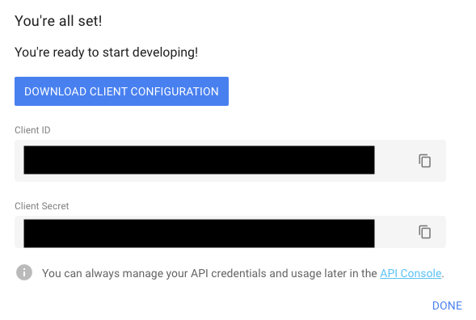

[](https://github.com/Prims47/FuegoBilling/actions)
[](https://goreportcard.com/report/github.com/Prims47/FuegoBilling)
[](https://codecov.io/gh/prims47/FuegoBilling)

# FuegoBilling


## Usage

### Download binary

You can download the latest version of the binary built for your architecture here:

* Architecture **i386** [
    [Darwin](https://github.com/Prims47/FuegoBilling/releases/latest/download/fuegoBilling-darwin-386) /
    [Linux](https://github.com/Prims47/FuegoBilling/releases/latest/download/fuegoBilling-linux-386)
]
* Architecture **amd64** [
    [Darwin](https://github.com/Prims47/FuegoBilling/releases/latest/download/fuegoBilling-darwin-amd64) /
    [Linux](https://github.com/Prims47/FuegoBilling/releases/latest/download/fuegoBilling-linux-amd64) /
    [Windows](https://github.com/Prims47/FuegoBilling/releases/latest/download/fuegoBilling-windows-amd64.exe)
]
* Architecture **arm** [
    [Linux](https://github.com/Prims47/FuegoBilling/releases/latest/download/fuegoBilling-linux-arm)
]

### Create your configuration files

You must create your `json` configurations files like (all fields are required):

```json
// your-personal-account.json
{
    "address": {
        "city": "Paris",
        "street": "770 rue Pepito",
        "country": "France",
        "zipCode": "75006"
    },
    "company": {
        "siret": "88462068300018",
        "tva": "FR77049322770",
        "capital": 100.00,
        "rcs": "Nanterre B",
        "naf": "6201Z",
        "type": "SARL"
    },
    "name": "Fuego by P",
    "firstname": "Ilan",
    "lastname": "Zerath",
    "mail": "pepito@fuegobyp.io"
}
```

```json
// your-customer.json
{
    "address": {
        "city": "Paris",
        "street": "47 rue Fuego",
        "country": "France",
        "zipCode": "75017"
    },
    "company": {
        "siret": "88462068300018",
        "tva": "FR77049322770",
        "type": "SARL"
    },
    "name": "Space X"
}
```

```json
// your-service.json
{
    "tva": {
        "pourcent": 20
    },
    "detail": "Prestation Pepito Fuego by P",
    "quantity": 7.5,
    "unitPrice": 863
}
```

### Export your PDF

> You have AWS (flag: aws) / Local (by default) / Google Drive (flag: drive)

#### AWS

> ! You must provide following env variable before the command:

```
AWS_SECRET_ACCESS_KEY="YOUR-ACCESS-KEY" AWS_ACCESS_KEY_ID="YOUR-KEY-ID" AWS_REGION="eu-west-3"
```

#### Google Drive

> ! Before launch the command you must follow this link (https://console.developers.google.com/apis)[https://console.developers.google.com/apis], go to identifier section and create a ID Client OAuth for desktop app



> ! When you launch the command, google ask to copy/paste a url in your browser. After accept all requirement you be able to use your drive.

### Create your billing

```shell
$ fuegoBilling generate-pdf --account-config-path your-personal-account.json --customer-config-path your-customer.json --service-config-path your-service.json --pdf-path your-pdf-path --export aws
```
